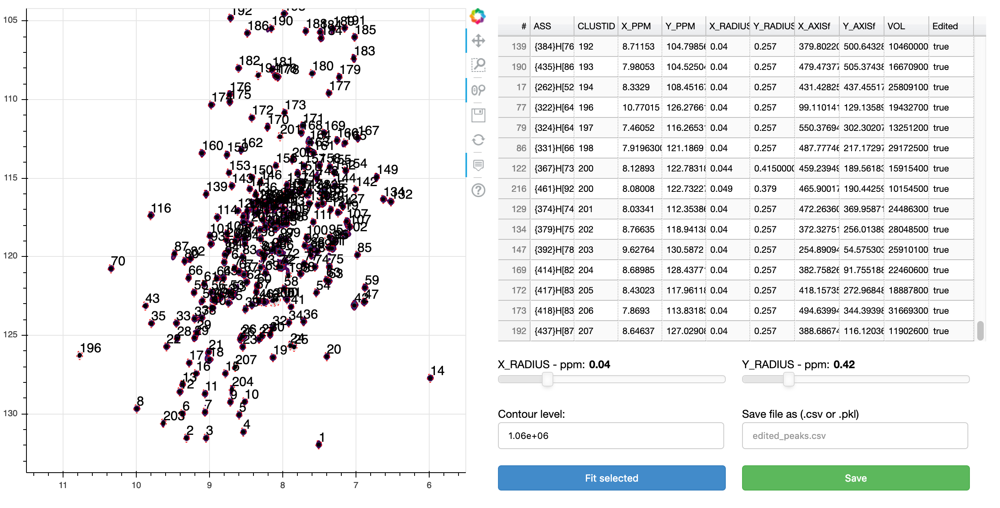

# Peakipy - NMR peak integration/deconvolution using python

[](https://travis-ci.com/j-brady/peakipy)

## Description

Simple deconvolution of NMR peaks for extraction of intensities. Provided an NMRPipe format spectrum (2D or Pseudo 3D)
 and a peak list (NMRPipe, Sparky or Analysis2), overlapped peaks are automatically/interactively clustered and groups
 of overlapped peaks are fitted together using Gaussian, Lorentzian or Pseudo-Voigt (Gaussian + Lorentzian).

## Installation

With poetry...

```bash
cd peakipy; poetry install
```

If you don't have poetry you can install it with pip

```bash
pip install poetry
```

With setup.py you will need python3.6 or greater installed.

```bash
cd peakipy; python setup.py install
```

At this point the package is installed and the main scripts (`read_peaklist.py`, `run_check_fits.py` and `fit_peaks.py`)
should have been added to your path.

## Inputs

1. Peak list (see below for specification)
2. NMRPipe frequency domain dataset (2D or Pseudo 3D)

There are three main scripts.

1. `read_peaklist.py` is used to convert peak list and select clusters peaks.
2. `run_check_fits.py` is used to check and adjust fit parameters interactively (i.e clusters and mask radii) if initial clustering is not satisfactory.
3. `fit_peaks.py` is used to fit clusters of peaks

Use the `-h` or `--help` flags for instructions on how to run the programs.

### Peaklists

First you need a peak list in either Sparky, Analysis2 or NMRPipe format.

#### Analysis2 peak list

Example of tab delimited peak list exported directly from Analysis2.

```bash
Number  #       Position F1     Position F2     Sampled None    Assign F1       Assign F2       Assign F3       Height  Volume  Line Width F1 (Hz)  Line Width F2 (Hz)      Line Width F3 (Hz)      Merit   Details Fit Method      Vol. Method
1       1       9.33585 129.67323       2.00000  {23}H[45]       {23}N[46]       2.0    3.91116e+07     2.14891e+08     15.34578        19.24590    None    1.00000 None    parabolic       box sum
2       2       10.38068        129.32604       2.00000  {9}H[17]        {9}N[18]        2.0    6.61262e+07     3.58137e+08     15.20785        19.76284        None    1.00000 None    parabolic       box sum

```

#### Sparky peak list

Minimum

```bash
Assignment  w1  w2
PeakOne 118 7.5
PeakTwo 119 7.4
etc...

```

Also accepted...

```bash
      Assignment         w1         w2        Volume   Data Height   lw1 (hz)   lw2 (hz)
          ALA8N-H    123.410      7.967   2.25e+08      15517405       15.8       20.5
         PHE12N-H    120.353      8.712   3.20e+08      44377264        9.3       16.6
         etc...
```

#### NMRPipe peaklist

Default peaklist generated by NMRDraw (e.g. test.tab)

```bash
VARS   INDEX X_AXIS Y_AXIS DX DY X_PPM Y_PPM X_HZ Y_HZ XW YW XW_HZ YW_HZ X1 X3 Y1 Y3 HEIGHT DHEIGHT VOL PCHI2 TYPE ASS CLUSTID MEMCNT
FORMAT %5d %9.3f %9.3f %6.3f %6.3f %8.3f %8.3f %9.3f %9.3f %7.3f %7.3f %8.3f %8.3f %4d %4d %4d %4d %+e %+e %+e %.5f %d %s %4d %4d

NULLVALUE -666
NULLSTRING *

    1   159.453    10.230  0.006  0.004    9.336  129.673  7471.831 10516.882   2.886   2.666   16.937   20.268  159  160    9   11 +2.564241e+07 +2.505288e+04 +1.122633e+08 0.00000 1 None    1    1
    2    17.020    13.935  0.002  0.002   10.381  129.326  8307.740 10488.713   2.671   2.730   15.678   20.752   16   18   13   15 +4.326169e+07 +2.389882e+04 +2.338556e+08 0.00000 1 None    2    1
    etc...
```

### NMRPipe Data

The input data should be either a NMRPipe 2D or 3D cube. The dimension order can be specified with the `--dims` flag.
For example if you have a 2D spectrum with shape (F1_size,F2_size) then you should call the scripts using `--dims=0,1`.
If you have a 3D cube with shape (F2_size,F1_size,ID) then you would run the scripts with `--dims=2,1,0` ([F2,ID,F1]
would be `--dims=1,2,0` i.e the indices required to reorder to 0,1,2).

### Running read_peaklist.py

Here is an example of how to run read_peaklist.py

```bash
read_peaklist.py peaks.sparky test.ft2 --sparky --show --outfmt=csv
```

This will convert your peaklist to into a `pandas DataFrame` and use `threshold_otsu` from `scikit-image` to determine a
 cutoff for selecting overlapping peaks.
These are subsequently grouped into clusters ("CLUSTID" column a la NMRPipe!)
The new peaklist with selected clusters is saved as a csv file `peaks.csv` to be used as input for either
`run_check_fits.py` or `fit_peaks.py`.


Clustered peaks are colour coded and singlet peaks are black (shown below).
If you want to edit this plot after running `read_peaklist.py` then you can edit `show_clusters.yml` and re-plot using
`spec.py show_clusters.yml`.


The threshhold level can be adjusted with the `--thres` option like so

```bash
read_peaklist.py peaks.sparky test.ft2 --sparky --show --outfmt=csv --thres=1e6
```


It is also possible to adjust the clustering behaviour by changing the structuring element used for binary closing.

```bash
read_peaklist.py peaks.sparky test.ft2 --dims=0,1,2 --show --outfmt=csv
```

If the automatic clustering is not satisfactory you can manually adjust clusters and fitting start parameters using
`run_check_fits.py`.

```bash
run_check_fits.py <peaklist> <nmrdata>
```



Select the cluster you are interested in using the table and double click to edit the cluster numbers.
Once a set of peaks is selected (or at least one peak within a cluster) you can manually adjust their starting
parameters for fitting (including the X and Y radii for the fitting mask, using the sliders)


If you like the parameters you have chosen then you can save the peak list using the `save` button. If you want to return to your edited peak
list at a later stage then run `run_check_fits.py` with the edited peak list as your `<peaklist>` argument.

## Protocol

Initial parameters for FWHM, peak centers and fraction are fitted from the sum of all planes in your spectrum (for best signal to
 noise). Following this, the default method is to fix center, linewidth and fraction parameters only fitting the amplitudes
 for each plane. If you want to float all parameters, this can be done with `--fix=None` or you could just float the
 linewidths and amplitudes with `--fix=fraction,center`.


## Outputs

1. Pandas DataFrame containing fitted intensities/linewidths/centers etc.

```bash
,fit_prefix,assignment,amp,amp_err,center_x,center_y,sigma_x,sigma_y,fraction,clustid,plane,fwhm_x,fwhm_y,center_x_ppm,center_y_ppm,sigma_x_ppm,sigma_y_ppm,fwhm_x_ppm,fwhm_y_ppm,fwhm_x_hz,fwhm_y_hz
0,_None_,None,291803167.58915764,5502181.0934204245,159.44747887142083,10.264911118698288,1.1610683960566748,1.1605030885314394,1.1516510856068862e-07,1,0,2.3221367921133496,2.3210061770628787,9.328949976009751,129.5761441197758,0.008514312030509797,0.1087866024456647,0.017028624061019595,0.2175732048913294,13.628076224917237,17.64583894576153
1,_None_,None,197442877.53398255,3671706.654558565,159.44747887142083,10.264911118698288,1.1610683960566748,1.1605030885314394,1.1516510856068862e-07,1,1,2.3221367921133496,2.3210061770628787,9.328949976009751,129.5761441197758,0.008514312030509797,0.1087866024456647,0.017028624061019595,0.2175732048913294,13.628076224917237,17.64583894576153
```

2. If `--plot=<path>` option selected the first plane of each fit will be plotted in <path> with the files named according to the cluster ID (CLUSTID) of the fit. Adding `--show` option calls `plt.show()` on each fit so you can see what it looks like.


## Pseudo-Voigt model


Where Gaussian lineshape is


And Lorentzian is


The fit minimises the residuals of the functions in each dimension


Fraction parameter is fraction of Lorentzian lineshape.

The linewidth for the G lineshape is


The linewidth for PV and L lineshapes is


## Test data

To test the program for yourself cd into the test dir and

## Comparison with NMRPipe

A sanity check... Peak intensities were fit using the nlinLS program from NMRPipe and compared with the output from peakipy for the same dataset.


## Homage to FuDA

If you would rather use FuDA then try running `read_peaklist.py` with the `--fuda` flag to create a FuDA parameter file
(params.fuda) and peak list (peaks.fuda).
This should hopefully save you some time on configuration.

## Acknowledgements

Thanks to Jonathan Helmus for writing the wonderful `nmrglue` package.
The `lmfit` team for their awesome work.
`bokeh` and `matplotlib` for beautiful plotting.
`scikit-image`!

My colleagues, Rui Huang, Alex Conicella, Enrico Rennella and Rob Harkness for their extremely helpful input.
