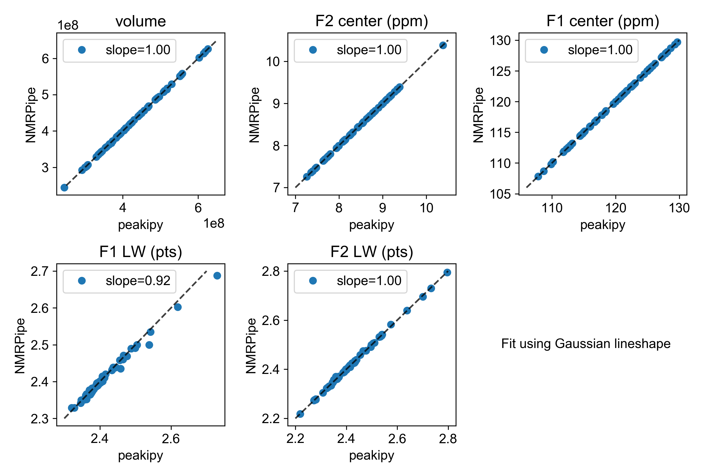

# Peakipy - NMR peak integration/deconvolution using python

[](https://travis-ci.com/j-brady/peakipy)

[peakipy documentation](https://j-brady.github.io/peakipy)

## Description

Simple deconvolution of NMR peaks for extraction of intensities. Provided an NMRPipe format spectrum (2D or Pseudo 3D)
 and a peak list (NMRPipe, Sparky or Analysis2), overlapped peaks are automatically/interactively clustered and groups
 of overlapped peaks are fitted together using Gaussian, Lorentzian or Pseudo-Voigt (Gaussian + Lorentzian) lineshape.

## Installation

The easiest way to install peakipy is with poetry...

```bash
cd peakipy; poetry install
```

If you don't have poetry you can install it with the following command

```bash
curl -sSL https://raw.githubusercontent.com/sdispater/poetry/master/get-poetry.py | python
```
Otherwise refer to the [poetry documentation](https://poetry.eustace.io/docs/) for more details

You can also install peakipy with `setup.py`. You will need python3.6 or greater installed.

```bash
cd peakipy; python setup.py install
```

At this point the package should be installed and the main scripts (`peakipy read`, `peakipy edit`, `peakipy fit` and `peakipy check`)
should have been added to your path.

## Inputs

1. Peak list (NMRPipe, Analysis v2.4, Sparky) 
2. NMRPipe frequency domain dataset (2D or Pseudo 3D)

There are four main commands:

1. `peakipy read` converts your peak list and selects clusters of peaks.
2. `peakipy edit` is used to check and adjust fit parameters interactively (i.e clusters and mask radii) if initial clustering is not satisfactory.
3. `peakipy fit` fits clusters of peaks.
4. `peakipy check` is used to check individual fits or groups of fits and make plots.

You can use the `-h` or `--help` flags for instructions on how to run the programs (e.g. peakipy read -h)


## Outputs

1. Pandas DataFrame containing fitted intensities/linewidths/centers etc.

```bash
,fit_prefix,assignment,amp,amp_err,center_x,center_y,sigma_x,sigma_y,fraction,clustid,plane,x_radius,y_radius,x_radius_ppm,y_radius_ppm,lineshape,fwhm_x,fwhm_y,center_x_ppm,center_y_ppm,sigma_x_ppm,sigma_y_ppm,fwhm_x_ppm,fwhm_y_ppm,fwhm_x_hz,fwhm_y_hz
0,_None_,None,291803398.52980924,5502183.185104156,158.44747896487527,9.264911100915297,1.1610674220702277,1.160506074898704,0.0,1,0,4.773,3.734,0.035,0.35,G,2.3221348441404555,2.321012149797408,9.336283145411077,129.6698850201278,0.008514304888101518,0.10878688239041588,0.017028609776203036,0.21757376478083176,13.628064792721176,17.645884354478063
1,_None_,None,197443035.67109975,3671708.463467884,158.44747896487527,9.264911100915297,1.1610674220702277,1.160506074898704,0.0,1,1,4.773,3.734,0.035,0.35,G,2.3221348441404555,2.321012149797408,9.336283145411077,129.6698850201278,0.008514304888101518,0.10878688239041588,0.017028609776203036,0.21757376478083176,13.628064792721176,17.645884354478063
etc...
```

2. If `--plot=<path>` option selected the first plane of each fit will be plotted in <path> with the files named according to the cluster ID (clustid) of the fit. Adding `--show` option calls `plt.show()` on each fit so you can see what it looks like. However, using `peakipy check` should be preferable since plotting the fits during fitting
slows down the process a lot.

3. To plot fits for all planes or interactively check them you can run `peakipy check`

```bash
peakipy check fits.csv test.ft2 --dims=0,1,2 --clusters=1,10,20 --show --outname=plot.pdf
```
Will plot clusters 1,10 and 20 showing each plane in an interactive matplotlib window and save the plots to a multipage pdf called plot.pdf. Calling `peakipy check`
with the `--first` flag results in only the first plane of each fit being plotted.

Run `peakipy check -h` for more options.

You can explore the output data conveniently with `pandas`.

```python
In [1]: import pandas as pd

In [2]: import matplotlib.pyplot as plt

In [3]: data = pd.read_csv("fits.csv")

In [4]: groups = data.groupby("assignment")

In [5]: for ind, group in groups:
   ...:     plt.errorbar(group.vclist,group.amp,yerr=group.amp_err,fmt="o",label=group.assignment.iloc[0])
   ...:     plt.legend()
   ...:     plt.show()
```

## Pseudo-Voigt model


Where Gaussian lineshape is


And Lorentzian is


The fit minimises the residuals of the functions in each dimension


Fraction parameter is fraction of Lorentzian lineshape.

The linewidth for the G lineshape is


The linewidth for PV and L lineshapes is


## Test data

Download from git repo. To test the program for yourself `cd` into the `test` directory . I wrote some tests for the code itself which should be run from the top directory like so `python test/test_core.py`.

## Comparison with NMRPipe

A sanity check... Peak intensities were fit using the nlinLS program from NMRPipe and compared with the output from peakipy for the same dataset.



## Homage to FuDA

If you would rather use FuDA then try running `peakipy read` with the `--fuda` flag to create a FuDA parameter file
(params.fuda) and peak list (peaks.fuda).
This should hopefully save you some time on configuration.

## Acknowledgements

Thanks to Jonathan Helmus for writing the wonderful `nmrglue` package.
The `lmfit` team for their awesome work.
`bokeh` and `matplotlib` for beautiful plotting.
`scikit-image`!

My colleagues, Rui Huang, Alex Conicella, Enrico Rennella, Rob Harkness and Tae Hun Kim for their extremely helpful input.
