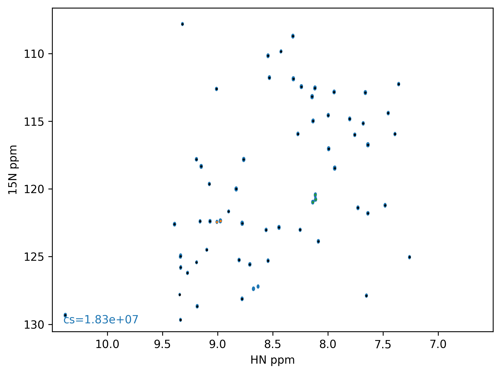
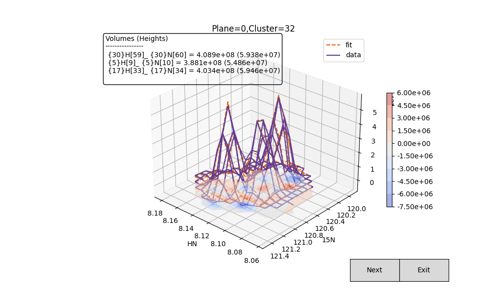
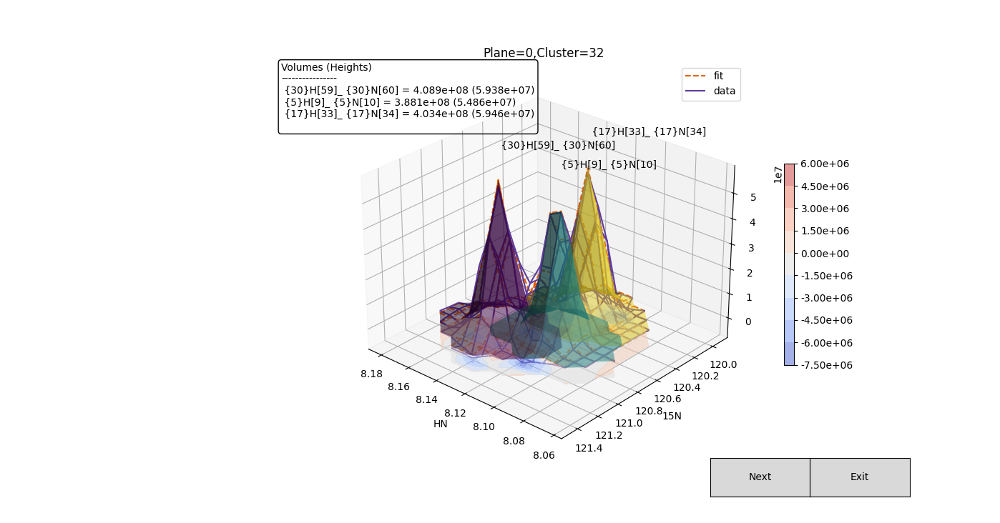
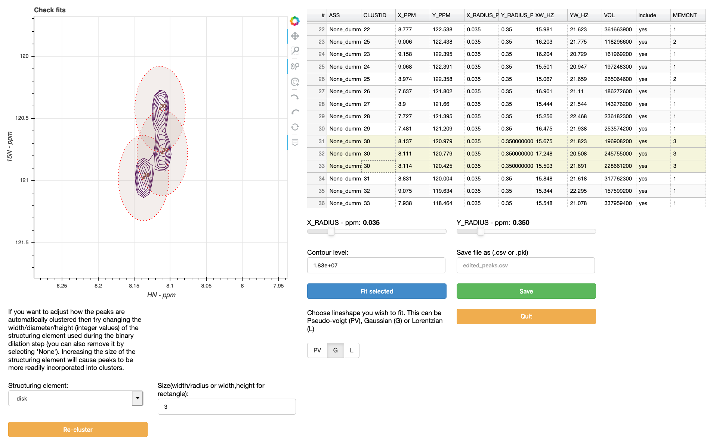

Examples
========

Protein L
---------

Having processed a spectrum and picked peaks in NMRPipe :

    peakipy read test.tab test1.ft2 pipe --y-radius-ppm 0.35 --x-radius-ppm 0.035 --show --struc-el disk --outfmt csv

Since the dimensions are in order ID,F1,F2 (Z,Y,X) there is no need to use the
`--dims` argument.

A contour plot of the spectrum with clustered peaks (color coded) is generated along with a `.csv` file of the
same name as your original peak list (i.e `test.csv`).

To fit the peaks simply run :

    peakipy fit test.csv test1.ft2 fits.csv --lineshape G

the `--lineshape G` option is used to fit the peaks to a Gaussian lineshape (in both dimensions).

If you have a `vclist` (or equivalent) then you can add this to your output data so that the planes can be sorted based on the vclist column.
    
    peakipy fit test.csv test1.ft2 fits.csv --lineshape G --vclist vclist
    
For interactive inspection of fits, run `peakipy check`:

    peakipy check fits.csv test1.ft2 --outname plots.pdf --clusters 30 --clusters 32 --show --first

Adding the `--individual` and `--label` flags will add the simulated lineshape for each fitted peak as a 3D surface along with the assignment labels.

Omitting the `--first` flag will result in a multi-page pdf with each plane plotted on a seperate page.
If you do not want to interactively display the fits then just omit the `--show` flag.
If you would like to plot the fits for all peaks then omit the `--clusters` flag.

If you find that you need to adjust the parameters of specific fits you can run :

    peakipy edit test.csv test1.ft2 

Which will open a `Bokeh` server in which you can adjust individual
parameters on each peak.

To save your edited peak list just click `Save`. You can open it again
later :

    peakipy edit edited_peaks.csv test1.ft2 

Your fitted intensities can be accessed conveniently through the
`fits.csv` output file using `pandas` or a spreadsheet.
