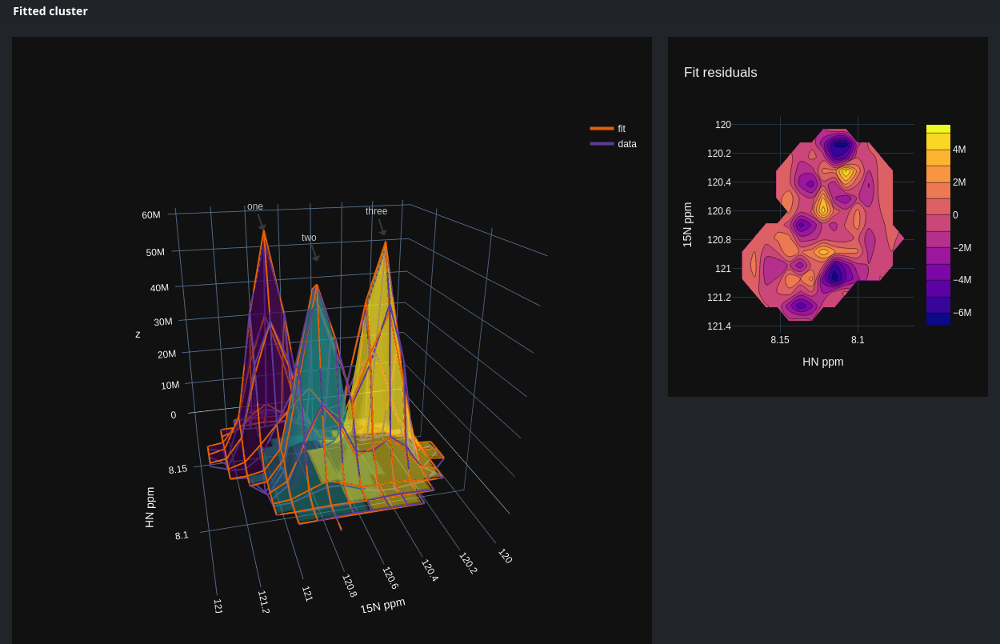

# Say hello to peakipy!

*Simple deconvolution of NMR peaks for extraction of intensities*

 - Cluster and group overlapping peaks
 - Fit and deconvolute clusters of peaks using selected lineshapes (Gaussian, Lorentzian, Pseudo-Voigt (Gaussian + Lorentzian) or Voigt).
 - Interactively edit initial fitting parameters and evaluate results 

