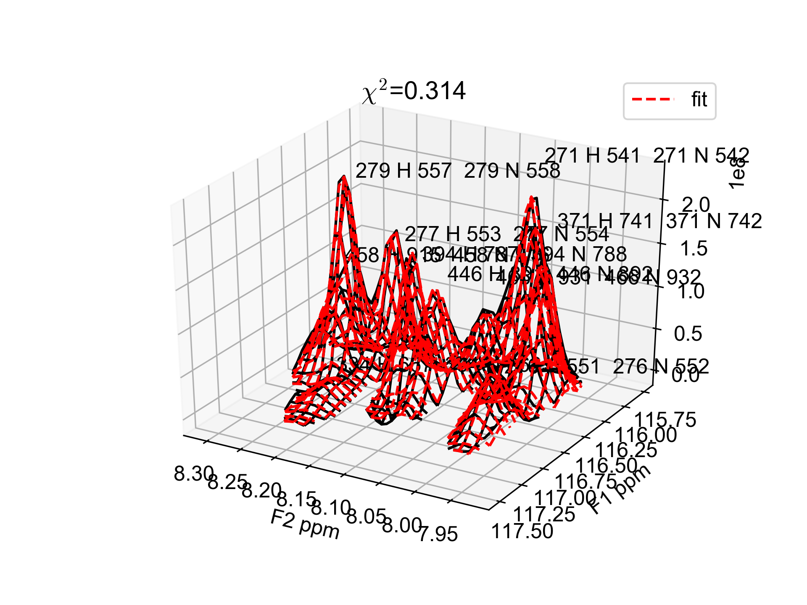

Instructions
============

Peak lists
----------

First you need a peak list in either Sparky, CCPNMRv2 (Analysis2), CCPNMRv3
(assign) or NMRPipe format. Alternatively, a `.csv` format file can be used. Details of peak list formats are explained below.

=== "CCPNMRv3 (a3)"

    Example of a tab delimited peak table exported directly from CCPNMRv3
    assign:

        #   Pid Spectrum    PeakList    Id  Assign F1   Assign F2   Pos F1  Pos F2  LW F1 (Hz)  LW F2 (Hz)  Height  HeightError Volume  VolumeError Merit   Annotation  Comment
        0   1   PK:test1_projection_H_N.1.1 test1_projection_H_N    1   1           10.380684043013412  129.32603752049937  14.179313120050438  18.675223392932594  66224788.0      None        1.0     
        1   2   PK:test1_projection_H_N.1.2 test1_projection_H_N    1   2           9.335853185661527   129.6732286432531   14.962974392261438  18.644570222511447  39807284.0      None        1.0     
        2   3   PK:test1_projection_H_N.1.3 test1_projection_H_N    1   3           9.185077855609203   128.66553436519882  13.786411378949163  18.70449353638719   56258792.0      None        1.0     

    !!! note 
        Empty `Assign F1` and `Assign F2` column rows will be replaced
        with dummy labels. Duplicated assignments will also be appended with
        dummy labels. This table can be exported from CCPNMRv3 assign by opening
        your peak list of interest as a module with the following steps:

        -   select peaks (Ctrl/Cmd + a)
        -   right click and select `Export All Columns`
        -   Save in `.tsv` format (tab separated) by using the
            dropdown for `Files of type`.

=== "CCPNMRv2 (a2)"

    Example of tab delimited peak list exported directly from Analysis2:

        Number  #       Position F1     Position F2     Sampled None    Assign F1       Assign F2       Assign F3       Height  Volume  Line Width F1 (Hz)  Line Width F2 (Hz)      Line Width F3 (Hz)      Merit   Details Fit Method      Vol. Method
        1       1       9.33585 129.67323       2.00000  {23}H[45]       {23}N[46]       2.0    3.91116e+07     2.14891e+08     15.34578        19.24590    None    1.00000 None    parabolic       box sum
        2       2       10.38068        129.32604       2.00000  {9}H[17]        {9}N[18]        2.0    6.61262e+07     3.58137e+08     15.20785        19.76284        None    1.00000 None    parabolic       box sum

    !!! note  
        `Position F1` and `Position F2` are often flipped 
        (i.e. F1=x and F2=y). I think this happens by default with
        Analysis2, however, you can chastise me for being an idiot if I'm
        wrong. `peakipy read` will flip them automatically, so beware. If you have
        "correctly" labelled columns then you can use `--posF1 <column_name>`
        and `--posF2 <column_name>` to define which column names map to `Y_PPM`
        and `X_PPM`, respectively.

=== "Sparky (sparky)"

    Minimum:

        Assignment  w1  w2
        PeakOne 118 7.5
        PeakTwo 119 7.4
        etc...

    Also accepted:

        Assignment         w1         w2        Volume   Data Height   lw1 (hz)   lw2 (hz)
            ALA8N-H    123.410      7.967   2.25e+08      15517405       15.8       20.5
        PHE12N-H    120.353      8.712   3.20e+08      44377264        9.3       16.6
        etc...

=== "NMRPipe (pipe)"

    Default peak list generated by NMRDraw (e.g. test.tab):

        VARS   INDEX X_AXIS Y_AXIS DX DY X_PPM Y_PPM X_HZ Y_HZ XW YW XW_HZ YW_HZ X1 X3 Y1 Y3 HEIGHT DHEIGHT VOL PCHI2 TYPE ASS CLUSTID MEMCNT
        FORMAT %5d %9.3f %9.3f %6.3f %6.3f %8.3f %8.3f %9.3f %9.3f %7.3f %7.3f %8.3f %8.3f %4d %4d %4d %4d %+e %+e %+e %.5f %d %s %4d %4d

        NULLVALUE -666
        NULLSTRING *

            1   159.453    10.230  0.006  0.004    9.336  129.673  7471.831 10516.882   2.886   2.666   16.937   20.268  159  160    9   11 +2.564241e+07 +2.505288e+04 +1.122633e+08 0.00000 1 None    1    1
            2    17.020    13.935  0.002  0.002   10.381  129.326  8307.740 10488.713   2.671   2.730   15.678   20.752   16   18   13   15 +4.326169e+07 +2.389882e+04 +2.338556e+08 0.00000 1 None    2    1
            etc...

=== "Custom .csv (csv)"

    A custom .csv file must have the following columns

        ASS,X_PPM,Y_PPM
        test1,8.763,117.821
        test2,8.973,122.359
        test3,9.005,122.436

    It is also possible to provide peak linewidth, volume and height estimates

        ASS,X_PPM,Y_PPM,XW_HZ,YW_HZ,VOL,HEIGHT
        test1,8.763,117.821,20.0,20.0,10,10
        test2,8.973,122.359,20.0,20.0,10,10
        test3,9.005,122.436,20.0,20.0,10,10


    You can then run peakipy with the following command
    
    `peakipy read test.csv test.ft3 csv`
        
=== "Peakipy .csv (peakipy)"

    If you would like to re-use a peakipy peaklist generated using `peakipy read` for a new dataset then you can use the `peakipy` argument

    `peakipy read test.csv test.ft3 peakipy`

       

NMR spectra 
-----------

Peakipy accepts NMRPipe processed spectra only. The input data should be either an NMRPipe 2D or 3D cube. By default, peakipy expects a pseudo-3D spectrum with dimension order ID, F1, F2 (Z, Y, X). It is recommended that you process your spectra so that the dimension order is Z, Y, X. However, you can specify the dimension order using the `--dims` flag. The order in which the `--dims` flags are provided reflects the order of the dimensions. The integer values reflect the index of the dimension you are re-ordering.

For example:

- For a 3D cube with shape `(X, Y, Z)` you would use `--dims 2 --dims 1 --dims 0` to re-shape to `(Z, Y, X)`.
- For a 3D cube with shape `(Y, X, Z)` you would use `--dims 2 --dims 0 --dims 1` to re-shape to `(Z, Y, X)`


The default dimension order is `(Z, Y, X)` (e.g. ID, F1, F2) (`--dims 0 --dims 1 --dims 2`).


!!! Note
    By default peakipy expects a pseudo 3D spectrum with dimension order Z, Y, X. For a 2D spectrum with dimension order Y, X then you need to run `peakipy read test.tab test.ft2 pipe --dims 0 --dims 1`


peakipy read
------------

Here is an example of how to read a Sparky peaklist into peakipy:

    peakipy read peaks.sparky test.ft2 sparky --show


This converts your peak list into a `pandas DataFrame` and uses
`threshold_otsu` (`scikit-image`) to determine a cutoff for clustering
overlapping peaks (cluster ids are added to the "CLUSTID" column a la NMRPipe!). The clustered peak list is saved as a csv file `peaks.csv` to be used as input for
either `peakipy edit` or `peakipy fit`. 

To set the threshold manually use the `--thres` option:

    peakipy read peaks.sparky test.ft2 sparky --show --thres 1e6

This will exclude signals below 1e6. However, it may be preferable to adjust this parameter interactively using `peakipy edit`.

Below is an example of a clustered peak list. Clustered peaks are colour coded and singlet peaks are black.


To adjust the clustering behaviour, change the
structuring element used for binary closing.

    peakipy read peaks.sparky test.ft2 --dims 0 --dims 1 --dims 2 --struc-el disk --struc-size 4 0 --show

The above would use a disk shaped structuring element with a radius of 4
points (see the
[scikit-image.morphology](http://scikit-image.org/docs/dev/api/skimage.morphology.html)
module for more information).

Adjust the radii used for masking the data by setting the `--x-radius-ppm` and `--y-radius-ppm` flags:

    peakipy read peaks.sparky test.ft2 sparky --dims 0 --dims 1 --dims 2 --y-radius-ppm 0.2 --x-radius-ppm 0.04


!!! note	
    `peakipy read` will generate a `peakipy.config` which is subsequently read by `edit`, `fit` and `check` so that the `--dims` option is not required after running `peakipy read`:
    ``` json
		{
			"dims": [
				0,
				1,
				2
			],
		}
    ```
		


peakipy edit
------------

If the automatic clustering is not satisfactory you can manually adjust
clusters and initial fitting parameters using `peakipy edit`. :

    peakipy edit <peaklist> <nmrdata>

As of peakipy 2.0.0 this will open a `panel` session in your internet browser that allows you to interactively edit peak fitting parameters.

This command will start a `bokeh` server and cause a tab to open in your
internet browser in which you can interactively edit peak fitting
parameters.


Use the table on the right to select the cluster(s) you are interested
and double click to edit values in the table. For example if you think
peak1 should be fitted with peak2 but they have different clustids then
you can simply change peak2's clustid to match peak1's.

Once a set of peaks is selected (or at least one peak within a cluster)
you can manually adjust their starting parameters for fitting (including
the X and Y radii for the fitting mask, using the sliders).

The effect of changing these parameters can be visualised by clicking on
the `Fit selected`.


!!! note
	If using matplotlib you will need to have your
	interactive backend correctly configured by editing your matplotlibrc
	file. If you don't know where that is then you can find it by importing
	matplotlib into your Python interpreter and typing
	`matplotlib.get_data_path()`. If you have trouble with opening
	interactive matplotlib my first suggestion is to check that you have a
	`matplotlibrc` file placed in your home directory
	`~/.matplotlib/matplotlibrc` with the backend option set to either
	`TkAgg` or `Agg`. These usually work:

	``` yaml
		backend: TkAgg
	```

	or :

	``` yaml
		backend: Agg
	```

	or for Mac users :

	``` yaml
		backend: macosx
	```


To test other peak clustering settings you can adjust the contour level
(akin to changing `--thres`) or adjust the dimensions of the structuring
element used for binary closing.



If you like the parameters you have chosen then you can save the peak
list using the `save` button. If you want to return to your edited peak
list at a later stage then run `peakipy edit` with the edited peak list
as your `<peaklist>` argument.

Clicking `Quit` closes the bokeh server.

Peaks can be added via the `tap` button on the right side of the
spectrum. Once the tap button is activated then peaks are added to the
spectrum by double clicking at the desired position.

peakipy fit
-----------

Once you are satisfied with your initial fitting parameters `peakipy fit` can be
run using the peak list generated by `peakipy read` or `peakipy edit`
(e.g. `edited_peaks.csv`).

For example... 

    peakipy fit edited_peaks.csv test.ft2 fits.csv --dims 0 --dims 1 --dims 2 --lineshape PV


Fits that are likely to need checking are flagged in the `log.txt` file.

If you have a `vclist` style file containing your delay values then you
can run `peakipy fit` with the `--vclist` option:

    peakipy fit edited_peaks.csv test.ft2 fits.csv --lineshape PV --vclist vclist

This will result in an extra column being added to your `fits.csv` file
called `vclist` containing the corresponding delay values.

!!! Note
    
    Here is an example of a vclist style file

        0.1
        0.2
        0.4
        0.8
        1.0


Checking fits
-------------

To plot fits for all planes or interactively check them you can run
`peakipy check`:

    peakipy check fits.csv test.ft2 --clusters 1 --clusters 10 --clusters 20 --show

Will plot clusters 1,10 and 20 showing each plane in an interactive
matplotlib window and save the plots to a multipage pdf called plot.pdf.
Calling `peakipy check` with the `--first` flag results in only the
first plane of each fit being plotted. The colour or output plots can be
changed using the `--colors` like so:

    peakipy check fits.csv test1.ft2 --colors green purple --clusters 30 --show --first


Only valid matplotlib color names can be used.

To open an interactive `panel` in your web browser

    peakipy check fits.csv test.ft2 --panel

Run `peakipy check --help` for more options.

Excluding peaks
---------------

Peaks can be excluded from fitting by changing the value in the
`include` column from `yes` to `no` (in the `.csv` file containing your
peak list). The easiest way to do this is via the `peakipy edit` script.

Protocol
--------

Initial parameters for FWHM, peak centers and fraction are fitted from
the sum of all planes in your spectrum (for best signal to noise).
Following this, the default method is to fix the center, linewidth and
fraction parameters only fitting the amplitudes for each plane. If you
want to float all parameters, this can be done with `--fix None` or you
could just float the linewidths and amplitudes with
`--fix fraction --fix center`.

Outputs
-------

1.  Pandas DataFrame containing fitted intensities/linewidths/centers
    etc:

        ,fit_prefix,assignment,amp,amp_err,center_x,center_y,sigma_x,sigma_y,fraction,clustid,plane,x_radius,y_radius,x_radius_ppm,y_radius_ppm,lineshape,fwhm_x,fwhm_y,center_x_ppm,center_y_ppm,sigma_x_ppm,sigma_y_ppm,fwhm_x_ppm,fwhm_y_ppm,fwhm_x_hz,fwhm_y_hz
        0,_None_,None,291803398.52980924,5502183.185104156,158.44747896487527,9.264911100915297,1.1610674220702277,1.160506074898704,0.0,1,0,4.773,3.734,0.035,0.35,G,2.3221348441404555,2.321012149797408,9.336283145411077,129.6698850201278,0.008514304888101518,0.10878688239041588,0.017028609776203036,0.21757376478083176,13.628064792721176,17.645884354478063
        1,_None_,None,197443035.67109975,3671708.463467884,158.44747896487527,9.264911100915297,1.1610674220702277,1.160506074898704,0.0,1,1,4.773,3.734,0.035,0.35,G,2.3221348441404555,2.321012149797408,9.336283145411077,129.6698850201278,0.008514304888101518,0.10878688239041588,0.017028609776203036,0.21757376478083176,13.628064792721176,17.645884354478063
        etc...

2.  `log.txt` contains fit reports for all fits
3.  If `--plot <path>` option selected when running `peakipy fit`, the
    first plane of each fit will be plotted in \<path\> with the files
    named according to the cluster ID (clustid) of the fit. Adding
    `--show` option calls `plt.show()` on each fit so you can see what
    it looks like. However, using `peakipy check` should be preferable
    since plotting the fits during fitting slows down the process a lot.

You can explore the output data conveniently with `pandas`. :

    In [1]: import pandas as pd

    In [2]: import matplotlib.pyplot as plt

    In [3]: data = pd.read_csv("fits.csv")

    In [4]: groups = data.groupby("assignment")

    In [5]: for ind, group in groups:
       ...:     plt.errorbar(group.vclist,group.amp,yerr=group.amp_err,fmt="o",label=group.assignment.iloc[0])
       ...:     plt.legend()
       ...:     plt.show()
