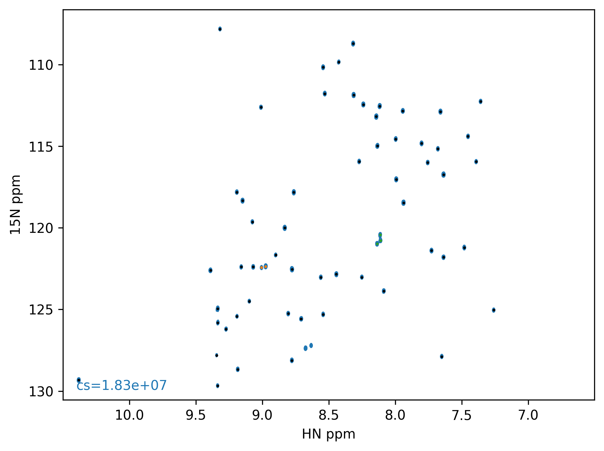

Examples
========

Protein L
---------

Having processed a spectrum and picked peaks in NMRPipe :

    peakipy read test.tab test1.ft2 --pipe --f1radius=0.35 --f2radius=0.035

Since the dimensions are in order ID,F1,F2 there is no need to use the
`--dims` argument.

A contour plot of the spectrum with clustered peaks color coded (orange,
green and blue) is generated along with a [.csv]{.title-ref} file of the
same name as your original peak list (i.e [test.csv]{.title-ref}).

To fit the peaks simply run :

    peakipy fit test.csv test1.ft2 fits.csv --lineshape=G

This will output another [.csv]{.title-ref} file called
[fits.csv]{.title-ref} containing the fitted intensities. In this case
the peaks are fit to a Gaussian lineshape (in both dimensions).

To generate plots of fits or inspect them interactively you can run :

    peakipy check fits.csv test1.ft2 --outname=plots.pdf --clusters=30 --show --first

This will plot the fit for the first plane of cluster 30 saving the
output in [plots.pdf]{.title-ref}. Omitting the `--first` flag will
result in a multi-page pdf with each plane plotted on a seperate page.
If you do not want to interactively display the fits then just omit the
`--show` flag. If you would like to plot all the fits then omit the
`--clusters` flag.

If you find that you need to adjust the parameters of specific fits you
can run :

    peakipy edit test.csv test1.ft2 

Which will open a `Bokeh` server in which you can adjust individual
parameters on each peak.

To save your edited peak list just click `Save`. You can open it again
later :

    peakipy edit edited_peaks.csv test1.ft2 

Your fitted intensities can be accessed conveniently through the
`fits.csv` output file using `pandas` or a spreadsheet.
