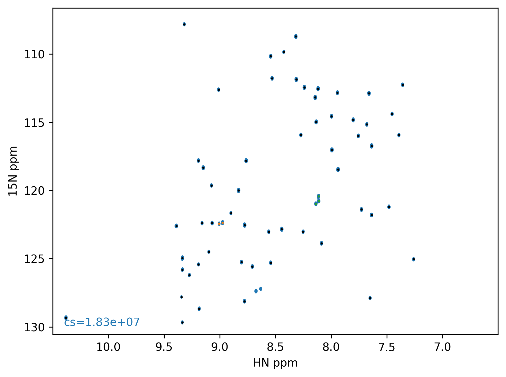

======================
Examples
======================

Protein L
---------

Having processed a spectrum and picked peaks in NMRPipe ::

        read_peaklist test.tab test1.ft2 --pipe --f1radius=0.35 --f2radius=0.035

Since the dimensions are in order ID,F1,F2 there is no need to use the ``--dims`` argument.

A contour plot of the spectrum with clustered peaks color coded (orange, green and blue) is generated along with a `.csv` file of the same name as your original peak list (i.e `test.csv`).

To fit the peaks simply run ::

        fit_peaks test.csv test1.ft2 fits.csv --lineshape=G

This will output another `.csv` file called `fits.csv` containing the fitted intensities. In this case the peaks are fit to a Gaussian lineshape (in both dimensions).

To generate plots of fits or inspect them interactively you can run ::

        check_fits fits.csv test1.ft2 --outname=plots.pdf --clusters=30 --show --first

.. image:: ../../../images/egplot.png

This will plot the fit for the first plane of cluster 30 saving the output in `plots.pdf`. Omitting the ``--first`` flag will result in a multi-page pdf with each plane plotted on a seperate page. If you do not want to interactively display the fits then just omit the ``--show`` flag. If you would like to plot all the fits then omit the ``--clusters`` flag. 

If you find that you need to adjust the parameters of specific fits you can run ::

        edit_fits test.csv test1.ft2 

Which will open a ``Bokeh`` server in which you can adjust individual parameters on each peak.

.. image:: ../../../images/bokeh2.png

To save your edited peak list just click ``Save``. You can open it again later ::

        edit_fits edited_peaks.csv test1.ft2 

Your fitted intensities can be accessed conveniently through the ``fits.csv`` output file using ``pandas`` or a spreadsheet.
