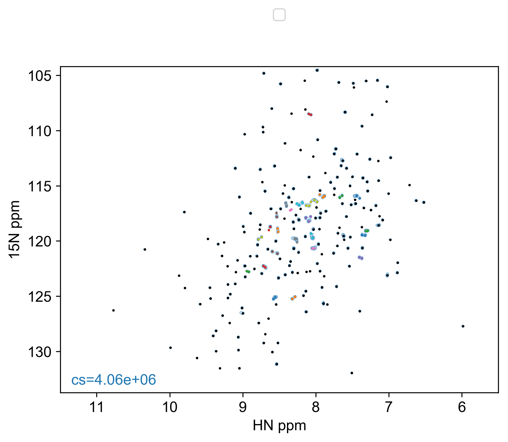
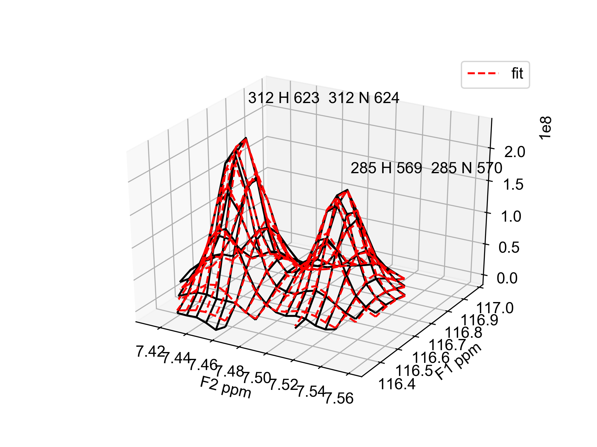

============
Instructions
============

First you need a peak list in either Sparky, Analysis2 or NMRPipe format.

Analysis2 peak list
-------------------

Example of tab delimited peak list exported directly from Analysis2::

        Number  #       Position F1     Position F2     Sampled None    Assign F1       Assign F2       Assign F3       Height  Volume  Line Width F1 (Hz)  Line Width F2 (Hz)      Line Width F3 (Hz)      Merit   Details Fit Method      Vol. Method
        1       1       9.33585 129.67323       2.00000  {23}H[45]       {23}N[46]       2.0    3.91116e+07     2.14891e+08     15.34578        19.24590    None    1.00000 None    parabolic       box sum
        2       2       10.38068        129.32604       2.00000  {9}H[17]        {9}N[18]        2.0    6.61262e+07     3.58137e+08     15.20785        19.76284        None    1.00000 None    parabolic       box sum

Note that the Position F1 and Position F2 are actually the wrong way round (i.e. F1=x and F2=y). I think this happens by default with Analysis2, however, you can chastise me for being an idiot if I'm wrong.
``read_peaklist`` will flip them around, so beware.
If you have "correctly" labelled columns then you can use ``--posF1=<column_name>`` and ``--posF2=<column_name>`` to define which column names map to ``Y_PPM`` and ``X_PPM``, respectively.

Sparky peak list
----------------

Minimum::

        Assignment  w1  w2
        PeakOne 118 7.5
        PeakTwo 119 7.4
        etc...

Also accepted::

      Assignment         w1         w2        Volume   Data Height   lw1 (hz)   lw2 (hz)
          ALA8N-H    123.410      7.967   2.25e+08      15517405       15.8       20.5
         PHE12N-H    120.353      8.712   3.20e+08      44377264        9.3       16.6
         etc...

NMRPipe peak list
-----------------

Default peak list generated by NMRDraw (e.g. test.tab)::

        VARS   INDEX X_AXIS Y_AXIS DX DY X_PPM Y_PPM X_HZ Y_HZ XW YW XW_HZ YW_HZ X1 X3 Y1 Y3 HEIGHT DHEIGHT VOL PCHI2 TYPE ASS CLUSTID MEMCNT
        FORMAT %5d %9.3f %9.3f %6.3f %6.3f %8.3f %8.3f %9.3f %9.3f %7.3f %7.3f %8.3f %8.3f %4d %4d %4d %4d %+e %+e %+e %.5f %d %s %4d %4d

        NULLVALUE -666
        NULLSTRING *

            1   159.453    10.230  0.006  0.004    9.336  129.673  7471.831 10516.882   2.886   2.666   16.937   20.268  159  160    9   11 +2.564241e+07 +2.505288e+04 +1.122633e+08 0.00000 1 None    1    1
            2    17.020    13.935  0.002  0.002   10.381  129.326  8307.740 10488.713   2.671   2.730   15.678   20.752   16   18   13   15 +4.326169e+07 +2.389882e+04 +2.338556e+08 0.00000 1 None    2    1
            etc...

NMRPipe Data
------------

The input data should be either an NMRPipe 2D or 3D cube. The dimension order can be specified with the ``--dims`` flag.
For example, if you have a 2D spectrum with shape (F1_size,F2_size) then you should call the scripts using ``--dims=0,1``.
If you have a 3D cube with shape (F2_size,F1_size,ID) then you would run the scripts with ``--dims=2,1,0`` ([F2,ID,F1]
would be ``--dims=1,2,0`` i.e the indices required to reorder to 0,1,2).
The default dimension order is ID,F1,F2.

read_peaklist
-------------

Here is an example of how to run read_peaklist::

        read_peaklist peaks.sparky test.ft2 --sparky --show

This will convert your peak list into a ``pandas DataFrame`` and use ``threshold_otsu`` from ``scikit-image`` to determine a cutoff for selecting overlapping peaks.
These are subsequently grouped into clusters ("CLUSTID" column a la NMRPipe!).
The new peak list with selected clusters is saved as a csv file ``peaks.csv`` to be used as input for either
``edit_fits`` or ``fit_peaks``.
It is possible to set the threshold value manually using the ``--thres`` option. However, it may be preferable to adjust this parameter within the ``edit_fits`` script.

Clustered peaks are colour coded and singlet peaks are black (shown below).
If you want to edit this plot after running ``read_peaklist`` then you can edit ``show_clusters.yml`` and re-plot using
``spec show_clusters.yml``. Below is an example of a clustered peak list.

The threshold level can be adjusted with the ``--thres`` option like so::

        read_peaklist peaks.sparky test.ft2 --sparky --show --thres=1e6

This will exclude signals below 1e6.

It is also possible to adjust the clustering behaviour by changing the structuring element used for binary closing.::

        read_peaklist peaks.sparky test.ft2 --dims=0,1,2 --struc_el=disk --struc_size=4, --show

The above would use a disk shaped structuring element with a radius of 4 points (see the `scikit-image.morphology <http://scikit-image.org/docs/dev/api/skimage.morphology.html>`_ module for more information).

The radii used for masking the data to be fitted can be adjusted by setting the ``--f2radius`` and ``--f1radius`` flags like so (values given in ppm)... ::

        read_peaklist peaks.sparky test.ft2 --dims=0,1,2 --f1radius=0.2 --f2radius=0.04

edit_fits
---------

If the automatic clustering is not satisfactory you can manually adjust clusters and fitting start parameters using ``edit_fits``. ::

        edit_fits <peaklist> <nmrdata>

This command will start a ``bokeh`` server and cause a tab to open in your internet browser in which you can interactively edit peak fitting parameters.

.. image:: ../bokeh.png

Use the table on the right to select the cluster(s) you are interested and double click to edit values in the table.
For example if you think peak1 should be fitted with peak2 but they have different clustids then you can simply change peak2's clustid to match peak1's.

Once a set of peaks is selected (or at least one peak within a cluster) you can manually adjust their starting
parameters for fitting (including the X and Y radii for the fitting mask, using the sliders).

The effect of changing these parameters can be visualised by clicking on the ``Fit selected`` button which will cause a ``matplotlib`` wireframe plot to popup. Note that you must close this ``matplotlib`` interactive window before continuing with parameter adjustments (I will try and add a 3D visualisation that works in the browser...).
You will need to have your interactive backend correctly configured by editing your matplotlibrc file. If you don't know where that is then you can find it by importing matplotlib into your Python interpreter and typing ``matplotlib.get_data_path()``. If you have trouble with opening interactive matplotlib my first suggestion is to check that you have a ``matplotlibrc`` file placed in your home directory ``~/.matplotlib/matplotlibrc`` with the backend option set to either ``TkAgg`` or ``Agg``. These usually work... ::

    backend: TkAgg

 
or ::

    backend: Agg

or for Mac users ::

    backend: macosx

for example.

To test other peak clustering settings you can adjust the contour level (akin to changing ``--thres``) or adjust the dimensions of the structuring element used for binary closing.

If you like the parameters you have chosen then you can save the peak list using the ``save`` button. If you want to return to your edited peak
list at a later stage then run ``edit_fits`` with the edited peak list as your ``<peaklist>`` argument.

Clicking ``Quit`` closes the bokeh server.

fit_peaks
---------

Once you are satisfied with your fitting parameters ``fit_peaks`` can be run using the peak list generated by ``read_peaklist`` or ``edit_peaks`` (e.g. ``edited_peaks.csv``).

For example... ::

        fit_peaks edited_peaks.csv test.ft2 fits.csv --dims=0,1,2 --lineshape=PV

Fits that are likely to need checking are flagged in the ``log.txt`` file.

If you have a ``vclist`` style file containing your delay values then you can run
``fit_peaks`` with the ``--vclist`` flag. ::

        fit_peaks edited_peaks.csv test.ft2 fits.csv --dims=0,1,2 --lineshape=PV --vclist=vclist

This will result in an extra column being added to your ``fits.csv`` file called ``vclist`` containing the corresponding delay values.

check_fits
----------

To plot fits for all planes or interactively check them you can run ``check_fits`` ::

        check_fits fits.csv test.ft2 --dims=0,1,2 --clusters=1,10,20 --show --outname=plot.pdf

Will plot clusters 1,10 and 20 showing each plane in an interactive matplotlib window and save the plots to a multipage pdf called plot.pdf. Calling ``check_fits`` with the ``--first`` flag results in only the first plane of each fit being plotted. The colour or output plots can be changed using the ``--colors`` like so ::

        check_fits fits.csv test.ft2 --dims=0,1,2 --clusters=1,10,20 --show --outname=plot.pdf --colors=green,purple

Only valid matplotlib color names can be used.

Run ``check_fits -h`` for more options.

Excluding peaks
---------------

Peaks can be excluded from fitting by changing the value in the ``include`` column from ``yes`` to ``no`` (in the ``.csv`` file containing your peak list). The easiest way to do this is via the ``edit_peaks`` script.

Protocol
--------

Initial parameters for FWHM, peak centers and fraction are fitted from the sum of all planes in your spectrum (for best signal to noise). Following this, the default method is to fix center, linewidth and fraction parameters only fitting the amplitudes for each plane. If you want to float all parameters, this can be done with ``--fix=None`` or you could just float the linewidths and amplitudes with ``--fix=fraction,center``.

Outputs
-------

1. Pandas DataFrame containing fitted intensities/linewidths/centers etc::

        ,fit_prefix,assignment,amp,amp_err,center_x,center_y,sigma_x,sigma_y,fraction,clustid,plane,x_radius,y_radius,x_radius_ppm,y_radius_ppm,lineshape,fwhm_x,fwhm_y,center_x_ppm,center_y_ppm,sigma_x_ppm,sigma_y_ppm,fwhm_x_ppm,fwhm_y_ppm,fwhm_x_hz,fwhm_y_hz
        0,_None_,None,291803398.52980924,5502183.185104156,158.44747896487527,9.264911100915297,1.1610674220702277,1.160506074898704,0.0,1,0,4.773,3.734,0.035,0.35,G,2.3221348441404555,2.321012149797408,9.336283145411077,129.6698850201278,0.008514304888101518,0.10878688239041588,0.017028609776203036,0.21757376478083176,13.628064792721176,17.645884354478063
        1,_None_,None,197443035.67109975,3671708.463467884,158.44747896487527,9.264911100915297,1.1610674220702277,1.160506074898704,0.0,1,1,4.773,3.734,0.035,0.35,G,2.3221348441404555,2.321012149797408,9.336283145411077,129.6698850201278,0.008514304888101518,0.10878688239041588,0.017028609776203036,0.21757376478083176,13.628064792721176,17.645884354478063
        etc...

2. If ``--plot=<path>`` option selected when running ``fit_peaks``, the first plane of each fit will be plotted in <path> with the files named according to the cluster ID (clustid) of the fit. Adding ``--show`` option calls ``plt.show()`` on each fit so you can see what it looks like. However, using ``check_fits`` should be preferable since plotting the fits during fitting slows down the process a lot.

You can explore the output data conveniently with ``pandas``. ::

        In [1]: import pandas as pd

        In [2]: import matplotlib.pyplot as plt

        In [3]: data = pd.read_csv("fits.csv")

        In [4]: groups = data.groupby("assignment")

        In [5]: for ind, group in groups:
           ...:     plt.errorbar(group.vclist,group.amp,yerr=group.amp_err,fmt="o",label=group.assignment.iloc[0])
           ...:     plt.legend()
           ...:     plt.show()

